# Getting started with SQLite

### Contents
- [Installation](#installation)
  - [Download](#download)
  - [Building SQLite](#building-sqlite)
  - Using Prebuilt Libraries
    - Windows
    - Mac
    - Linux
- [Set-Up](#set-up)
  - [Create a Database](#create-a-database)
  - [Integrate into Application](#integrate-into-application) 
- [ACID-Properties](#acid-properties) 
  - [Atomicity](#atomicity)
  - [Consistency](#consistency)
  - [Isolation](#isolation)
  - [Durability](#durability) 

# Installation
## Download
[This is the official download repository](https://www.sqlite.org/download.html) where you can find all the prebuilt binaries for your machine, or get a copy 
of the sources and compile them yourself. Be careful to download the correct files for your system if you use prebuilt binaries.

## Building SQLite
In order to build SQLite yourself, you first need to extract the [latest SQLite release](https://www.sqlite.org/2023/sqlite-autoconf-3420000.tar.gz) to your local files. In there you will find the C source code for SQLite.    The second step is now to Compile these files. For this you will need a C-Compiler like [gcc](https://gcc.gnu.org) or [MinGW](https://www.mingw-w64.org).   If you unpacked the tar file, move there within your console using 'cd'. Once you are in the right directory, run './configure'.    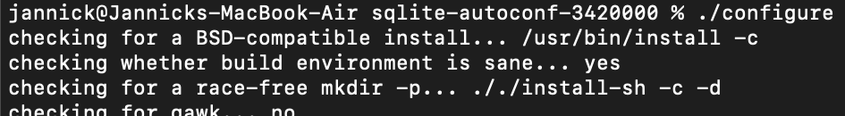    This will create a makefile, which u can now run using your OS specific compiler. Typically 'make' for IOS/Linux or 'mingw32-make' for windows.   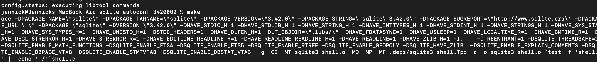    
Alternatively, you can download the Zip file from the downloads page that dows not include a configuration or TEA and compile the files by hand / create your own makefile.   Congratulations! You have now successfully installed SQLite. To set up your first database, click [here](#set-up).

# Set-UP
## Create a database
After successfully installing SQLite, you can create a database with the console command 'sqlite3 /path/to/database/test.db'. If you do not specify the path, the .db file will be created in the current directory you're in.
  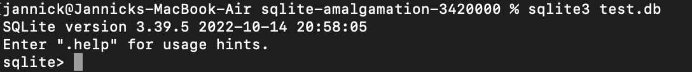    
Once the database is created, you are within the SQLite Shell, where you now are able to use the database by running commands like SELECT, INSERT, UPDATE, DELETE, CREATE TABLE, ALTER TABLE... . The General syntax of commands within the shell is: COMMAND [OPTIONS] [DATABASE] [TABLE]. 
  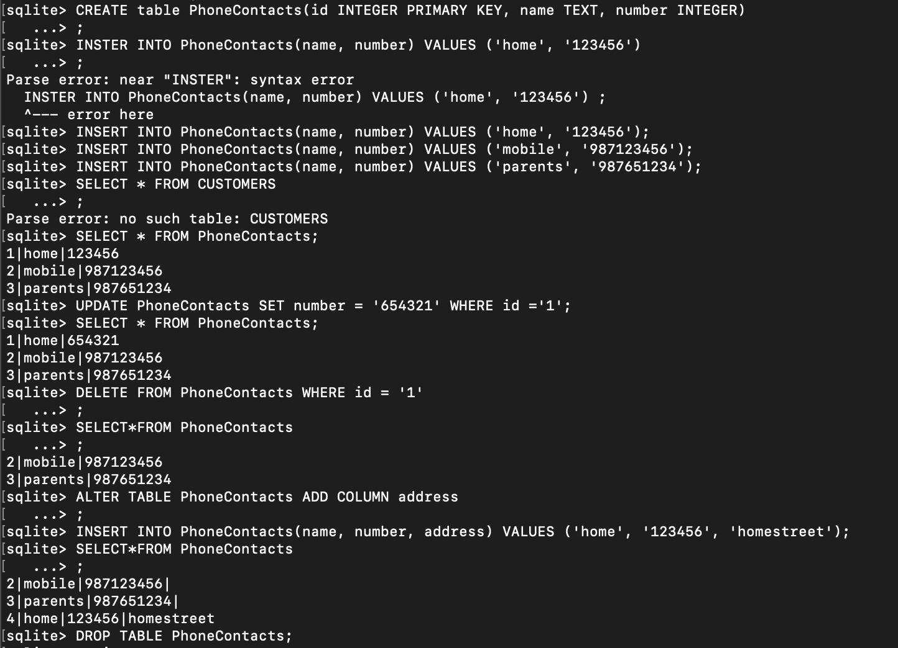    
If needed, you can also add a trigger. A trigger is a procedural code that automatically executes in response to specific events in a database, such as insertions, updates, or deletions. It is associated with a table and performs actions based on the event, such as data validation, manipulation, or additional queries. Triggers help enforce data integrity, implement business rules, and automate tasks in a database system.
     
In order to display the data in a table in a wished format, you can create a view.
     
If you want to look up the tables currently present in your database, enter '.tables' within the Shell. 
  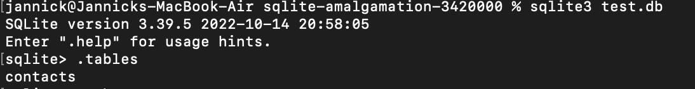    
To look up the schema of a specific table, enter '.schema "tableName"'. 
   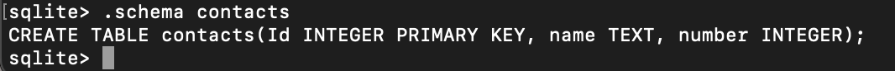   
In order to look up all databases within your current SQLite connection, use '.databases'.
  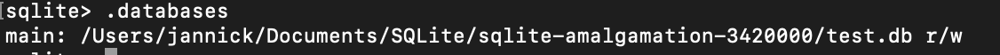    
This will list all databases with their path. Database files can be added to the current connnection using the 'ATTACH DATABASE "PATH/TO/.dbFile" AS alias'
  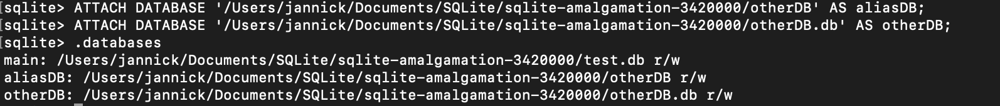 
But be careful, if you forget the the file type, here to see in the "aliasDB", where I forgot the .db, the database will be a virtual database (transient in-memory database), instead of a physical, which means it is not Persistent, but stored in the RAM. This also applies for not specifying the exact database when calling only 'sqlite3'
  You can exit the SQLite shell with '.quit'. 
  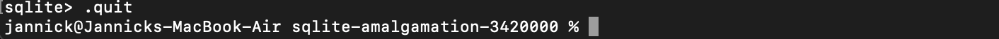   

# Integrate into Application

# ACID properties
## Atomicity
SQLite is Atomic. This means, that all changes to the database are performed together. Either they all succeed, or they all fail. You can test this by making two changes and then either ROLLBACK or COMMIT. Look for not-ROLLBACKED and not-COMMITED changes. Check combinations of rows changed by 1 UPDATE, rows changed by 2 UPDATEs in the same table, different tables or different attached databases.  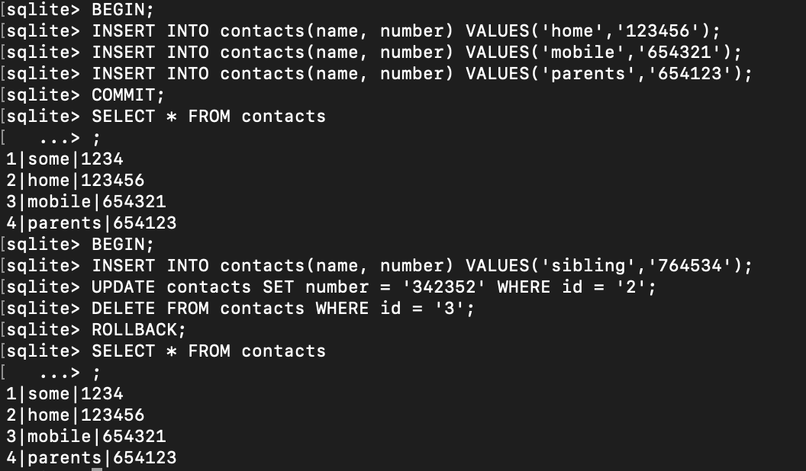   

## Consistency
SQLite enforces data consistency. This means, only valid and consistent data can be stored in the database. You can test this by inserting/updating rows that violate constraints (remember to enable foreign key constraints). What those are is up to the author of the schema.  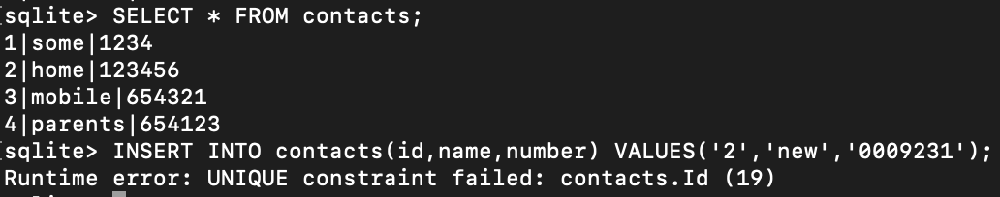   

## Isolation
SQLite transactions are independent/isolated from one another. You can test this by performing two transactions on the same row/table/database/across multiple attached databases in independent threads/processes. Check that data reread after both transactions are complete conform to expecations. In SQLite you will have to set a busy timeout to avoid the second transaction failing with "database is locked". Try to start the transactions simultaneously, so the changes occur in both orders.  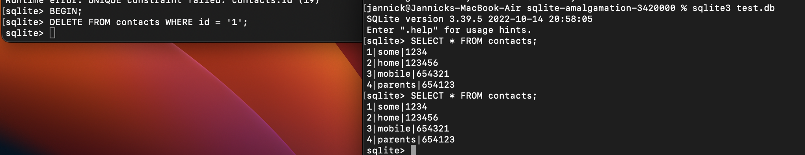  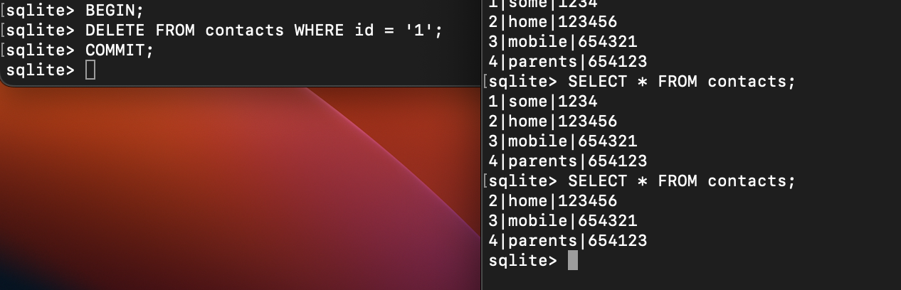   

## Durability
SQLite is durable. This means, committed changes are durable and survive system failures. You can test this by killing threads/processes/power while transactions are in all states of progress (before/after first/last change, during commit), check to see if all comitted transactions are still present after the journal/WAL file has been processed.

