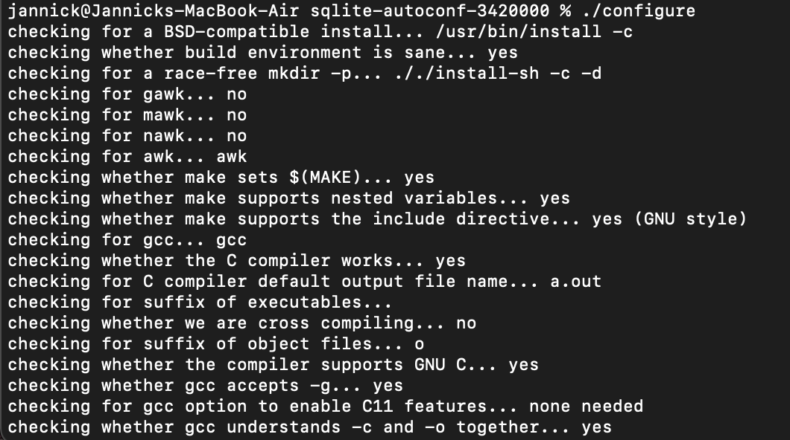
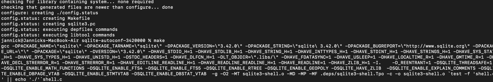
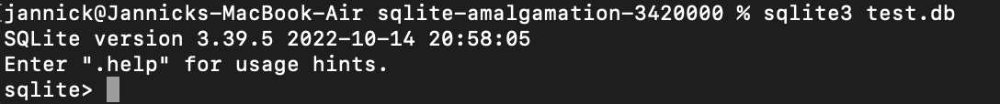

# Installaton & Setup-Guide

### Contents
- Installation
  - [Download](#download)
  - [Building SQLite](#building-sqlite)
  - Using Prebuilt Libraries
    - Windows
    - Mac
    - Linux
- [Set-Up](#set-up)

## Download
The first thin to do in order to set up a SQLite Database is to get a copy of the prebuilt binaries for your machine, or get a copy 
of the sources and compile them yourself. Be careful to download the correct files for your system if using prebuilt binaries. All 
downloads can be found [here](https://www.sqlite.org/download.html). 

## Building SQLite
In order to build SQLite yourself, you first need to extract the [latest SQLite release](https://www.sqlite.org/2023/sqlite-autoconf-3420000.tar.gz) to your local files. In there you will find the C source code for SQLite.    The second step is now to Compile these files. For this you will need a C-Compiler like [gcc](https://gcc.gnu.org) or [MinGW](https://www.mingw-w64.org).   If you unpacked the tar file, move there within your console using 'cd'. Once you are in the right directory, run './configure'.         This will create a makefile, which u can now run using your OS specific compiler.        
Alternatively, you can download the Zip file from the downloads page that dows not include a configuration or TEA and compile the files by hand / create your own makefile.   Congratulations! You have now successfully installed SQLite. To set up your first database, click [here].

## Set-UP
After successfully installing SQLite, you can create a database with the console command 'sqlite3 /path/to/database/test.db'. If you do not specify the path, the .db file will be created in the current directory you're in.    
    Once the database is created, you are within the SQLite Shell, where you now are able to use the database by running commands like SELECT, INSERT, UPDATE, DELETE, CREATE TABLE, ALTER TABLE... . The General syntax of commands within the shell is: sqlite> COMMAND [OPTIONS] [TABLE]; instead of COMMAND [OPTIONS] [DATABASE] [TABLE].       You can exit the SQLite shell with .quit.       In order to look up all databases within your SQLite installation, use .databases. This will list all databases with their path.

